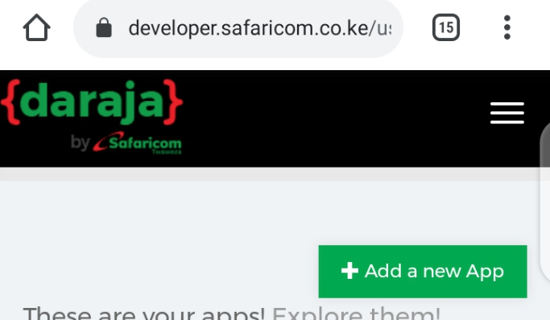
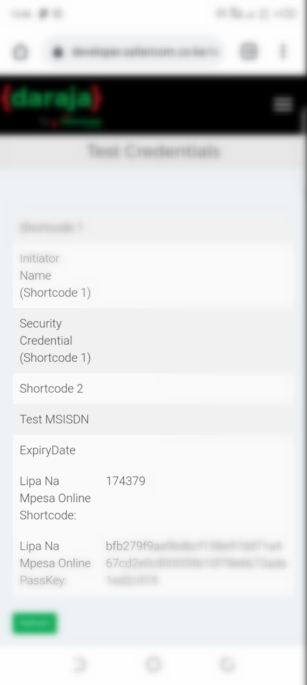
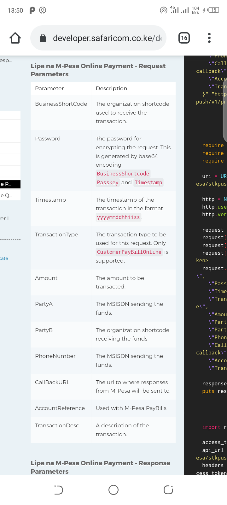
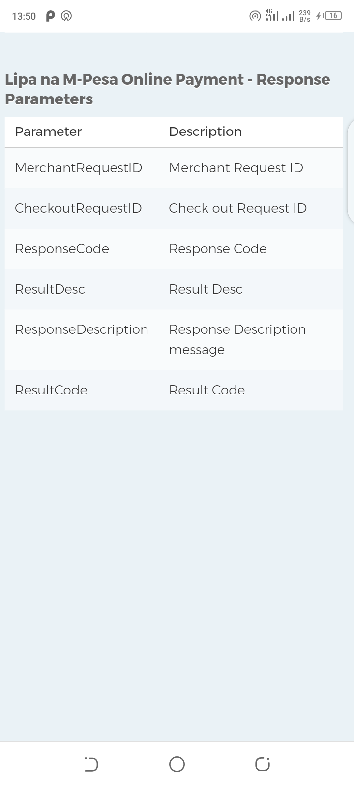

## Getting Started

Add dependency in pubspec.yaml

```yaml
dependencies:
  lipa_na_mpesa_online: [ADD_LATEST_VERSION_HERE]
```
# LIPANAMPESA ONLINE STK PUSH C2B
## 1. Create An App in Safaricom Sandbox After creating an account. [here](https://developer.safaricom.co.ke/),


#
## 2 Get your lipana mpesa pass keys and shortcode [here]()


## Parameters in ```lipanampesa()``` method
 ```dart 
lipanampesa()
//params imag

```

## Response Params.


In on pressed func, perform 
```dart 
lipanampesa(with all @requred params.)

```
#

```dart
import 'package:lipa_na_mpesa_online/lipa_na_mpesa_online.dart';
import 'package:path/to/your/key.dart' as key;

void make_payment_to_mpesa_stkpush() {
var pay = lipanampesa(key.lipa_na_mpesa_passkey, key.business_short_code, key.consumer_key, key.consumer_secret, key.phone_number, key.transactiontype, key.amount, key.callbackURL, key.accountref, key.transactionDesc);
}
```